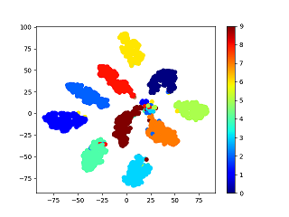

# Metric Learning ([npair loss](http://www.nec-labs.com/uploads/images/Department-Images/MediaAnalytics/papers/nips16_npairmetriclearning.pdf) & [angular loss](https://arxiv.org/pdf/1708.01682.pdf)) on mnist and Visualizing by t_SNE
---
|n_pair_loss|n_pair_angular_loss|  
|||  

## Usage
run from top on terminal   
`pip install -r requirements.txt`  
`python mnist_to_img.py` -- produce mnist data separated by label  
`python Sampling.py` -- produce `image_path.txt`and`n_pair_index.txt`  
`python n_pair_train.py` -- save model to `checkpoints\checkpoint.pth.tar`  
`python t_SNE.py` -- show t_SNE  
