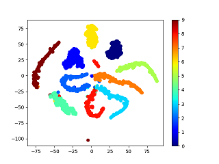

# Metric Learning ([npair loss](http://www.nec-labs.com/uploads/images/Department-Images/MediaAnalytics/papers/nips16_npairmetriclearning.pdf) & [angular loss](https://arxiv.org/pdf/1708.01682.pdf)) on mnist and Visualizing by t_SNE

n_pair_loss|n_pair_angular_loss
---|---
|

## Usage
run from top on terminal   
`pip install -r requirements.txt`  
`python src/utils/mnist_to_img.py` -- return mnist data separated by label  
`python src/n_pair_train.py` -- save model to `src/checkpoints/checkpoint.pth.tar`and log `logs/2019_00_CNN/*`  
`python src/t_SNE.py` -- show t_SNE  
